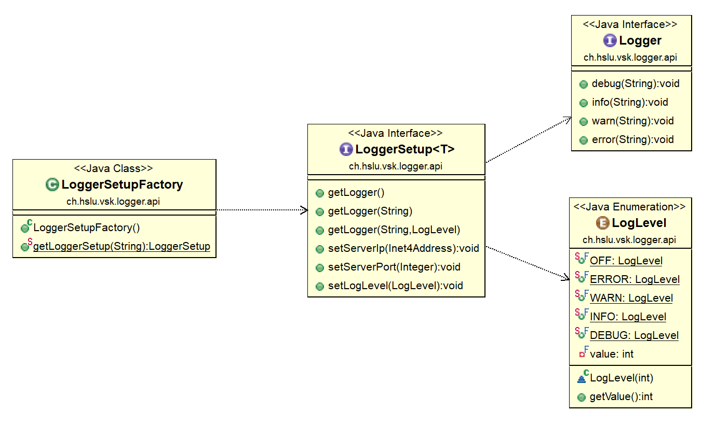

# Schnittstellenspezifikation *Logger*


Mit dem `Logger` können in einer Applikation
Events mit verschiedenen Levels geloggt werden.

Ein Level beschreibt die Wichtigkeit eines Events.

Die Loglevel (absteigende priorität) sind:

 - `LogLevel.OFF = 0`
 - `LogLevel.ERROR = 10`
 - `LogLevel.WARNING = 20`
 - `LogLevel.INFO = 30`
 - `LogLevel.DEBUG = 40`

Der logger wurde absichtlich sehr simpel gehalten
um die Anwendung des Loggers so einfach wie möglich
zu gestalten.

Das Errorhandling des Loggers ist so implementiert,
dass er keine Fehler wirft. Der Logger
soll die Applikation nicht zum Absturz bringen.


## Spezifikation

Das Interface `Logger` und `LoggerSetup` wird wie folgt beschrieben:



Das Interface `LoggerSetup` wird gebraucht, da
Java keine statischen Methoden in Interfaces definieren kann.

Das Loglevel soll dazu dienen, dass nur bestimmt Events geloggt werden.
Ist das Level beispielsweise auf `Logger.WARN` gesetzt
werden alle logs mit `log.debug("...")` nicht geloggt.


### Spezifikation `LoggerSetup` , `Logger`, `LoggerSetupFactor`

Details entnehmen Sie bitte der javadoc des interfaces.


## Anwendung des Loggers

Eine mögliche implementation der Factory und des zurückgegebenen LoggerSetup Objektes

```java
	private static LoggerSetup loggerSetup;
	private static Logger LOG;

	public static void main(String args[]) {
		
		// Get Loggersetup 
		try {
			loggerSetup = LoggerSetupFactory.getLoggerSetup("ch.hslu.vsk.logger.component.LoggerComponentSetup");
			LOG = loggerSetup.getLogger();
		} catch (ClassNotFoundException | InstantiationException | IllegalAccessException | IllegalArgumentException
				| InvocationTargetException | NoSuchMethodException | SecurityException e) {
			// TODO proper error handling
			e.printStackTrace();
		}		
	}
```

Ausgehend vom Logger Setup das erstellen der unterschiedlichen Logger

```java
	public final class AlertBox extends Dialog {

	Logger LOG = StandaloneGameOfLife.loggerSetup.getLogger("AlertBox");
	LOG.warn("Example Warning");
```